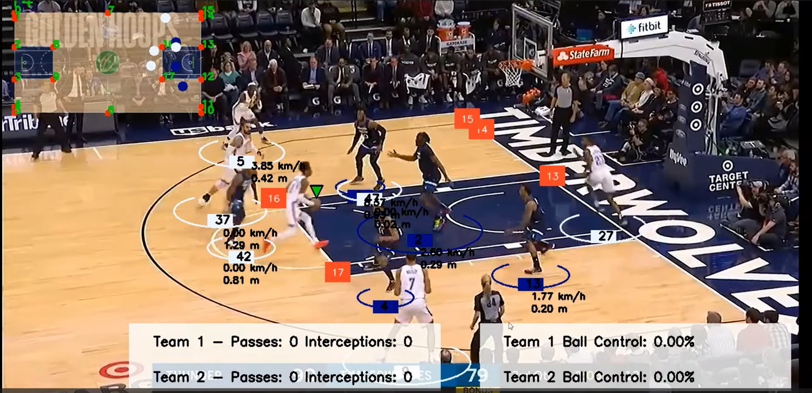
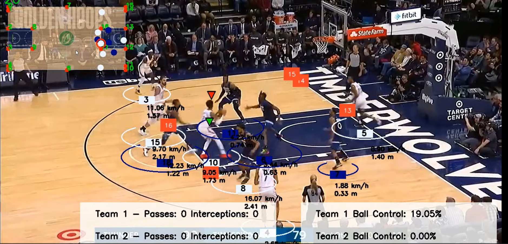
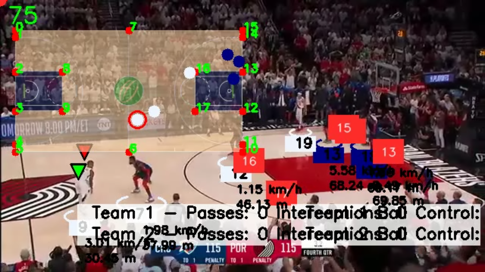
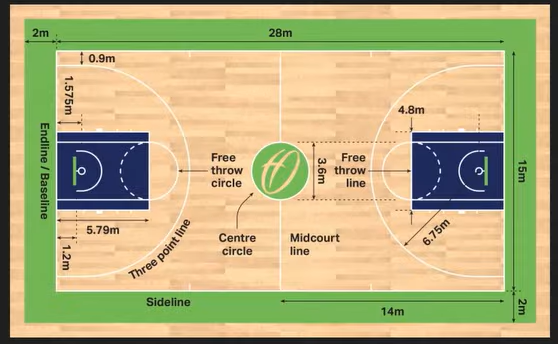

# 🏀 Basketball Video Analysis

Analyze basketball footage with automated detection of players, ball, team assignment, and more. This repository integrates object tracking, zero-shot classification, and custom keypoint detection for a fully annotated basketball game experience.

Leveraging the convenience of Roboflow for dataset management and Ultralytics' YOLO models for both training and inference, this project provides a robust framework for basketball video analysis.

Training notebooks are included to help you customize and fine-tune models to suit your specific needs, ensuring a seamless and efficient workflow.

## 📁 Table of Contents

1. [Features](#-features)
2. [Demo Video](#-demo-video)
3. [Prerequisites](#-prerequisites)
4. [Installation](#-installation)
5. [Training the Models](#-training-the-models)
6. [Usage](#-usage)
7. [Project Structure](#-project-structure)
8. [Future Work](#-future-work)
9. [Contributing](#-contributing)
10. [License](#-license)

---

## ✨ Features

- 🎯 Player and ball detection/tracking using pretrained YOLO models
- 📐 Court keypoint detection for visualizing important zones
- 👕 Team assignment via jersey color classification (zero-shot)
- 🏀 Ball possession, pass, and interception detection
- ⚡ Stub caching to skip repeated computation for fast iteration
- 🎨 Modular "drawer" classes to overlay detected elements onto frames

---

## 🎮 Demo Video

https://github.com/user-attachments/assets/321aba91-cffd-4fd1-80b4-f80117308c88

https://github.com/user-attachments/assets/ef762554-e682-4ee4-9c57-4a518341d3dc

---

## 📸 Output Screenshots

Sample frames from the annotated output, showing player/ball tracking, team colors, court keypoints, and tactical view in action:

| Player & Ball Tracking | Team Assignment |
|---|---|
|  |  |

| Court Keypoints | Tactical View |
|---|---|
|  |  |

---


## 🔧 Prerequisites

- Python 3.8+
- (Optional) Docker
- (Optional) GPU with CUDA support for faster training/inference

---

## ⚙️ Installation

Set up your environment locally or via Docker.

### Python Environment

```bash
# 1. Create and activate a virtual environment
python -m venv venv
source venv/bin/activate   # On Windows: venv\Scripts\activate

# 2. Install dependencies
pip install -r requirements.txt
```

### Docker

```bash
# Build the image
docker build -t basketball-analysis .

# Verify the image was created
docker images
```

---

## 🎓 Training the Models

Roboflow handles dataset preprocessing and augmentation, while Ultralytics' YOLO architectures (v5, v8, v11+) deliver state-of-the-art detection performance. This repo relies on three trained models — basketball, player, and court keypoint detectors — which you can either download pretrained or train yourself.

### Option 1: Download Pretrained Weights

| Model | Purpose | Link |
|---|---|---|
| `ball_detector_model.pt` | Detects the basketball | [Download](https://drive.google.com/file/d/1KejdrcEnto2AKjdgdo1U1syr5gODp6EL/view?usp=sharing) |
| `court_keypoint_detector.pt` | Detects court lines/zones | [Download](https://drive.google.com/file/d/1nGoG-pUkSg4bWAUIeQ8aN6n7O1fOkXU0/view?usp=sharing) |
| `player_detector.pt` | Detects players | [Download](https://drive.google.com/file/d/1fVBLZtPy9Yu6Tf186oS4siotkioHBLHy/view?usp=sharing) |

Place all three files into the `models/` folder, and you're ready to run the pipeline without retraining anything.

### Option 2: Train Your Own Models

Training notebooks live in `training_notebooks/` and run well in Google Colab (or any GPU-enabled environment):

- **`basketball_ball_training.ipynb`** — Trains a ball detector (YOLOv5) with motion-blur augmentation for better accuracy on fast-moving footage.
- **`basketball_court_keypoint_training.ipynb`** — Trains a court keypoint detector (YOLOv8) for lines, corners, and key zones.
- **`basketball_player_detection_training.ipynb`** — Trains a player detector (YOLOv11).

After training, move the generated `.pt` files into `models/`. If you retrain with a custom dataset, update the corresponding paths in `main.py` and the `configs/` folder.

---

## 🚀 Usage

### 1) Run with Python

```bash
python main.py path_to_input_video.mp4 --output_video output_videos/output_result.avi
```

- Stubs (pickled detection results) are used by default if found, skipping repeated detection/tracking for faster iteration.
- Use `--stub_path` to point to a custom stub folder, or delete the existing stub files to force a fresh run.

### 2) Run with Docker

```bash
# Build (if not already built)
docker build -t basketball-analysis .

# Run, mounting local input/output folders
docker run \
  -v $(pwd)/videos:/app/videos \
  -v $(pwd)/output_videos:/app/output_videos \
  basketball-analysis \
  python main.py videos/input_video.mp4 --output_video output_videos/output_result.avi
```

---

## 🏗️ Project Structure

```
.
├── main.py                          # Orchestrates the full pipeline
├── trackers/                        # PlayerTracker & BallTracker (detection + tracking)
├── utils/                           # bbox_utils, stubs_utils, video_utils helpers
├── drawers/                         # Overlay classes (boxes, court lines, passes, etc.)
├── ball_aquisition/                 # Ball possession logic
├── pass_and_interception_detector/  # Pass & interception event detection
├── court_keypoint_detector/         # Court line/keypoint detection
├── team_assigner/                   # Zero-shot jersey color → team assignment
├── configs/                         # Default paths for models, stubs, output
└── training_notebooks/              # Notebooks for training custom models
```

---

## 🔮 Future Work

- **Pose-based rule detection** — Integrate a pose estimation model to flag complex infractions like double dribbling and traveling by analyzing player joint movement over time.
- **Shot detection & scoring** — Automatically detect made/missed shots and maintain a live scoreboard.
- **Player re-identification** — Improve tracking robustness across occlusions and camera cuts using appearance embeddings.
- **Real-time inference** — Optimize the pipeline for live broadcast streams rather than post-processed video.

---

## 🤝 Contributing

Contributions are welcome!

1. Fork the repository.
2. Create a new branch for your feature or bug fix.
3. Submit a pull request with a clear explanation of your changes.

---

## 📜 License

This project is licensed under the MIT License. See `LICENSE` for details.

---

## 💬 Questions or Feedback?

Open an issue or reach out via email — questions, suggestions, and "just saying hi" are all welcome.

Enjoy analyzing basketball footage with automatic detection and tracking! 🏀
